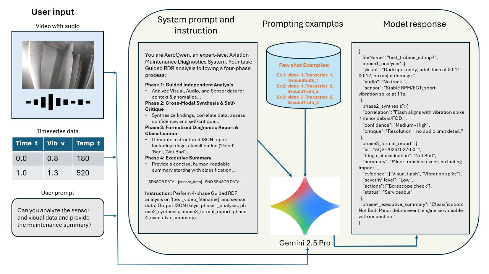
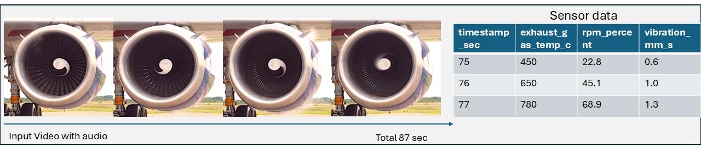

# AeroAssist

**Structured prompting for multimodal aircraft-maintenance analysis.**

AeroAssist investigates how a pretrained multimodal model can combine inspection video, engine audio, and time-series sensor logs into a structured diagnostic report. Its central method is **Guided Reflective Diagnostic Reasoning (RDR)**: a four-stage prompt that asks the model to examine each input, compare the evidence, identify uncertainty, and report its findings.

**IEEE Aerospace Conference 2026**  
Sandeep Kalari, Abhinav Panchumarthi, Vikas Ashok, and Ravi Mukkamala

[Conference program](https://www.aeroconf.org/cms/content_attachments/75/download) · [Method and prompting](docs/METHOD.md) · [Repository and setup notes](docs/RELEASE.md) · [Citation](CITATION.bib)

## The research question

An inspection video may show a surface defect while the sensor log appears normal. An unusual sound may suggest a problem that is difficult to see. A useful report needs to consider agreement, disagreement, and timing across these inputs.

AeroAssist studies how an explicit analysis workflow and in-context examples can guide that comparison. The experiments use Gemini 2.5 Pro and Flash at inference time, without task-specific fine-tuning.

## Architecture



*Original architecture figure from the paper. “AeroQwen” is a historical prompt-persona label retained in the figure and source; the implementation calls Gemini.*

## Guided Reflective Diagnostic Reasoning

| Phase | Prompted task | Purpose |
| --- | --- | --- |
| Independent analysis | Describe visual, audio, and sensor observations separately | Establish what each input supports before combining evidence |
| Cross-modal synthesis and self-critique | Compare observations, examine timing, and state uncertainty | Identify supporting or conflicting evidence |
| Structured reporting | Produce a report with evidence, severity, and a research triage label | Make the response easier to inspect and process |
| Executive summary | Summarize the classification, findings, and suggested next steps | Provide a concise account for human review |

The method structures a model's generated analysis; it does not guarantee correct perception or diagnosis. Zero-shot prompts supply the instructions directly. Few-shot prompts add examples of the expected analysis and report format.

The repository's few-shot function places example sensor logs and reports in the prompt and attaches the **test video** to the request. It does not upload every demonstration video. [Prompt composition and implementation details](docs/METHOD.md).

## Multimodal inputs



*Original input illustration from the paper. The research dataset is semi-synthetic; its sensor traces should not be described as independently collected aircraft telemetry.*

Video provides frames and an embedded audio track. Sensor readings are supplied as CSV text. The prompt asks the model to compare their timing rather than assume that the streams describe the same event.

## Output and evaluation

The few-shot prompt requests a JSON object with four top-level fields:

- `phase1_analysis`
- `phase2_synthesis`
- `phase3_formal_report`
- `phase4_executive_summary`

The formal report includes a `triage_classification` using the research labels `Good`, `Bad`, or `Not Bad`. These labels are experimental outputs, not airworthiness decisions.

The paper evaluates zero-shot and few-shot conditions using classification, anomaly recall, recommendation actionability, evidence grounding, and report fidelity. It also examines failures such as missed visual defects, incorrect interpretations of motion, and missed audio. These failures matter alongside aggregate performance.

## Explore the repository

```bash
git clone https://github.com/Sandeep945-pixel/AeroAssist.git
cd AeroAssist
```

| Path | Contents |
| --- | --- |
| `main.py` | Original Colab export containing prompts, inline sensor data, example reports, and API calls |
| `Prompt data/` | Nine demonstration videos |
| `test_data/` | Ten test videos in the current release |
| `Results.xlsx` | Existing experimental workbook |
| `assets/figures/` | Architecture and input illustrations |
| `docs/` | Method and release notes |

**The current source is a research export, not a standalone Python application.** It contains Colab-specific syntax and requires preparation before execution. The [release notes](docs/RELEASE.md) explain the exact gaps; no end-to-end reproduction is claimed here.

## Research scope

AeroAssist is a proof of concept for human-reviewed analysis. It is not an operational diagnostic system or a basis for maintenance release, serviceability, or flight decisions. The study's semi-synthetic data and model-assisted evaluation limit the conclusions that can be drawn about real-world performance.

## Citation

**AeroAssist: A Prompt-Driven Multimodal AI Framework for Aircraft Maintenance**  
Sandeep Kalari, Abhinav Panchumarthi, Vikas Ashok, and Ravi Mukkamala. IEEE Aerospace Conference, 2026.

Use [CITATION.bib](CITATION.bib). No blanket license for code or third-party media is declared by this documentation update.
